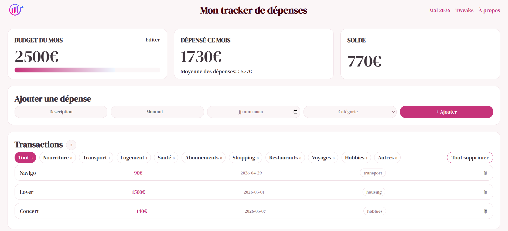

# My Expense Tracker

A simple and clean expense management app built to practice JavaScript, DOM manipulation and responsive design.

The app allows you to manage a monthly budget, track your expenses and store data directly in the browser.



---

## Features
- Add and delete expenses
- Edit the monthly budget
- Automatic balance and monthly expense calculation
- Filter expenses by category
- French / English language toggle
- Euro / Dollar currency toggle
- Light / Dark mode
- Data persistence with LocalStorage
- Responsive design with media queries

---

## Tech Stack
- HTML5 / CSS3
- Flexbox & Media Queries
- JavaScript Vanilla
- DOM Manipulation
- Event Listeners
- LocalStorage

---

## Run locally

Access it directly via GitHub Pages : [Live Demo](https://nouraastafofana-droid.github.io/Expense-Tracker/)

Or

```bash
git clone https://github.com/nouraastafofana-droid/Expense-Tracker

---

## Project goal

This project was built as part of my JavaScript learning journey. The goal was to build a complete app from scratch to practice logic, event handling, local storage and responsive UI.
